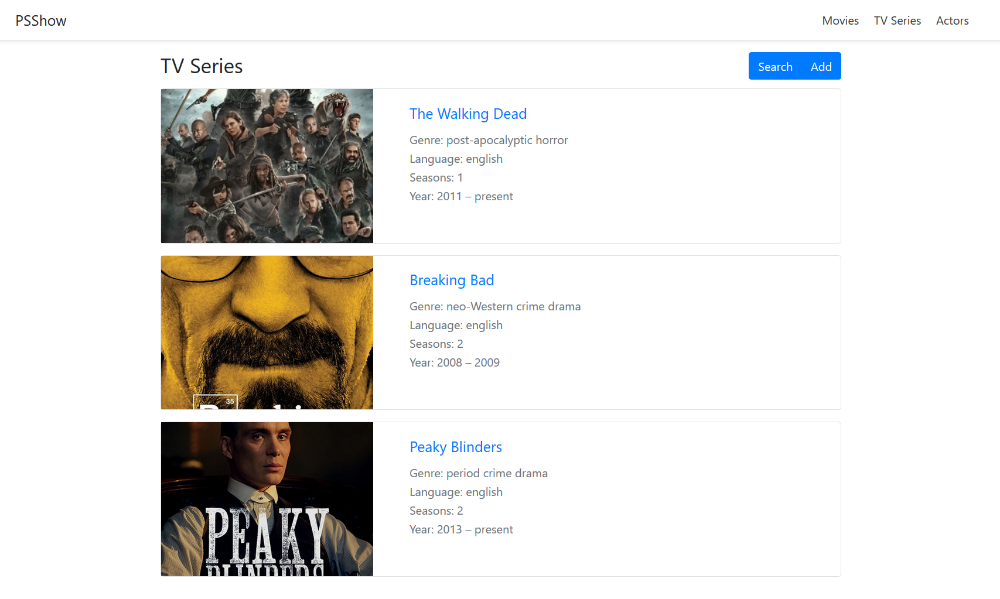
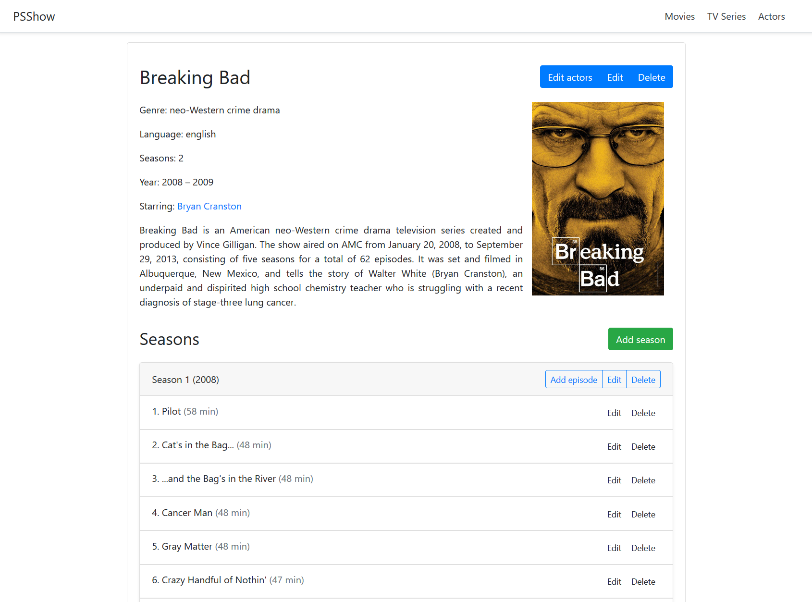
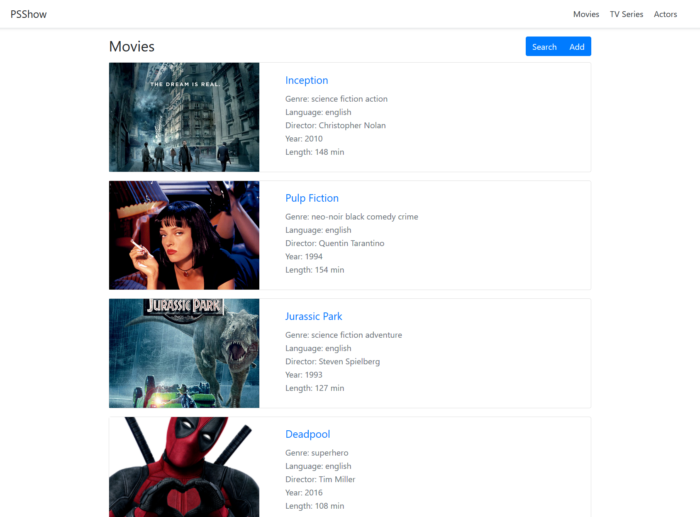
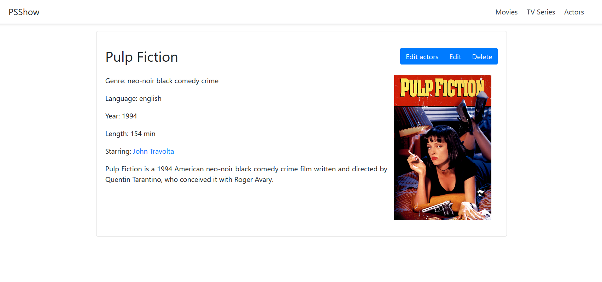
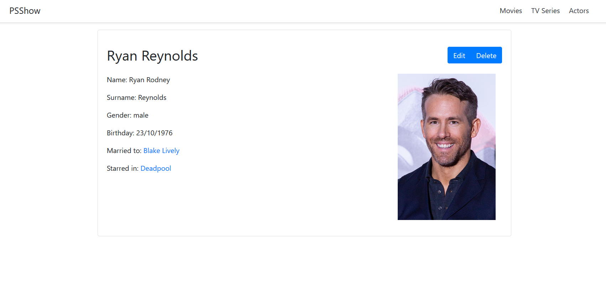

# PSShow
PSShow is a web application that allows to manage a database of TV shows, movies and actors. It is developed using Spring Boot and PostgreSQL.

## Screenshot
### Series

### Movies

### Actors

### How to run
1) Install PostgreSQL 13.1 (https://www.enterprisedb.com/downloads/postgres-postgresql-downloads)
2) While installing, set the password for the default user ("postgres") as "password", and set the port to 5432
3) Open the terminal and move to the bin directory of Postgres (in Windows `C:\Program Files\PostgreSQL\13\bin`)
4) Run `psql -U postgres -c "CREATE DATABASE springdb;"`
5) Run `psql -U postgres -d springdb -f /path/to/db.sql` (where `/path/to/` is the path of the main directory of this repo) to load the database informations
6) Install Java (https://www.java.com/en/download/)
7) Download the executable (https://drive.google.com/file/d/1NNYnFRU1LHa68dLlwRD5p9WxORfOqPif/view?usp=sharing)
8) Run java -jar /path/to/assignment3-0.0.1-SNAPSHOT.jar (where `/path/to/` is the path of the binary downloaded in step 7)
9) Open the browser and go to http://localhost:8080
